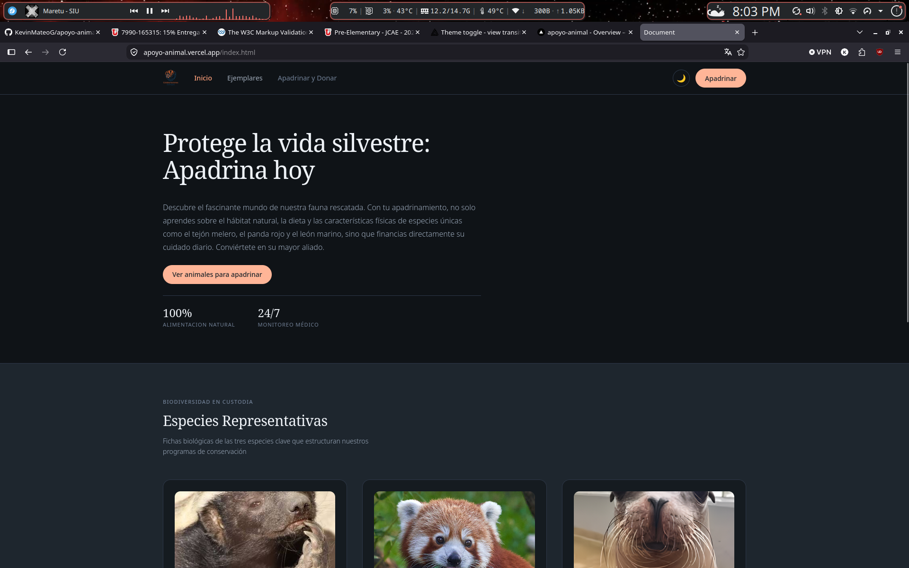
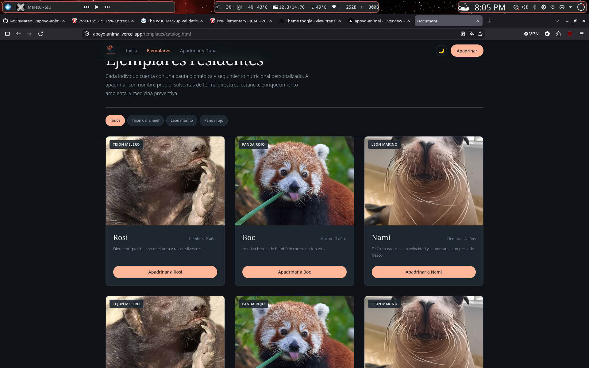
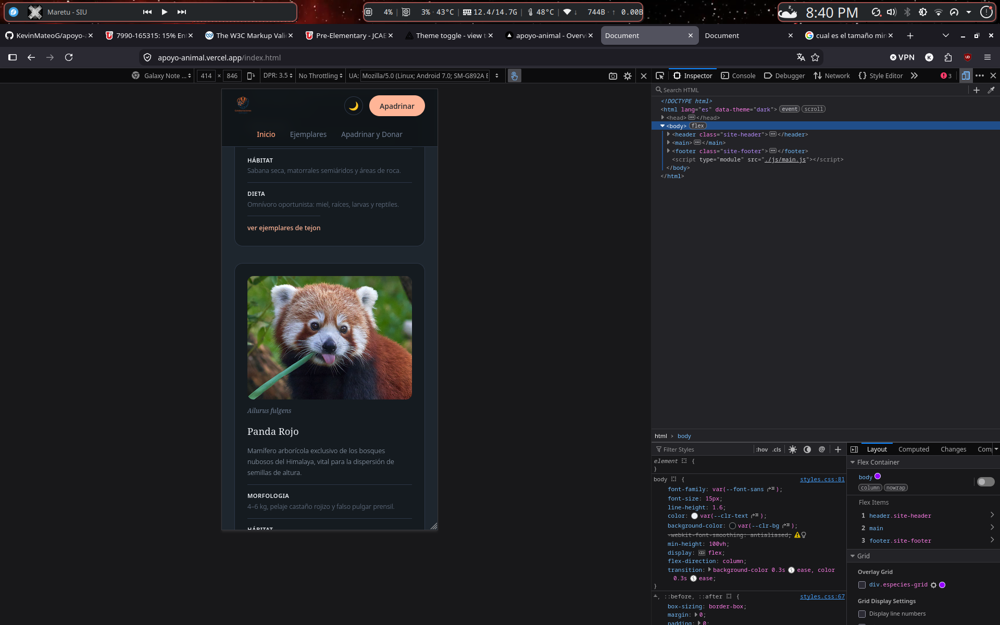
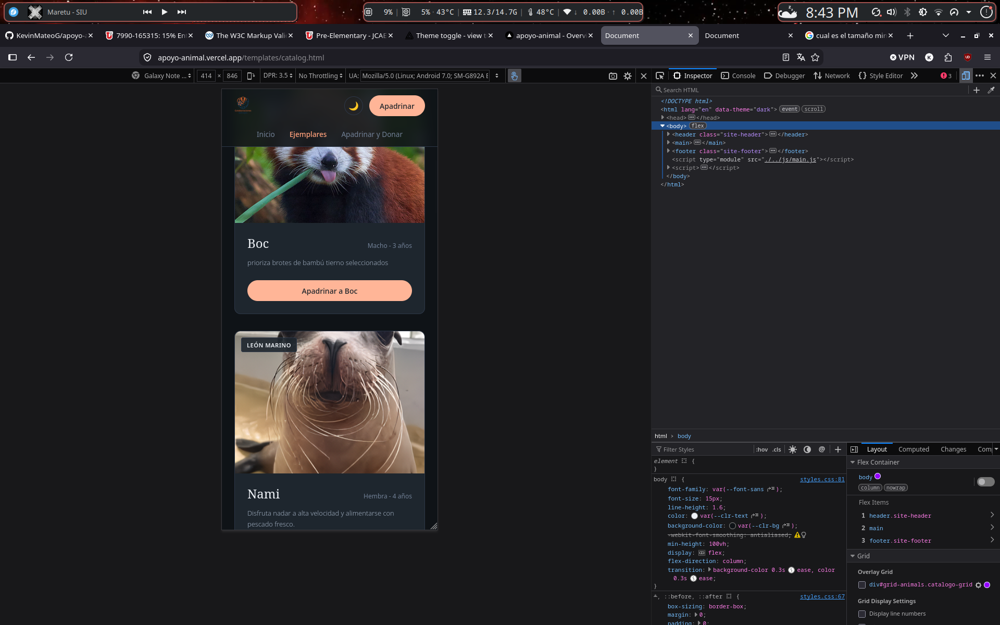
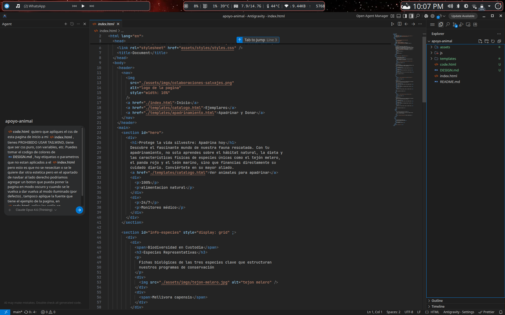
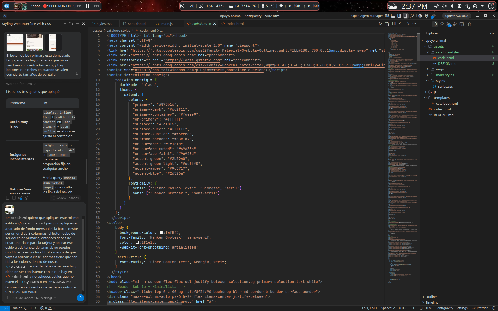
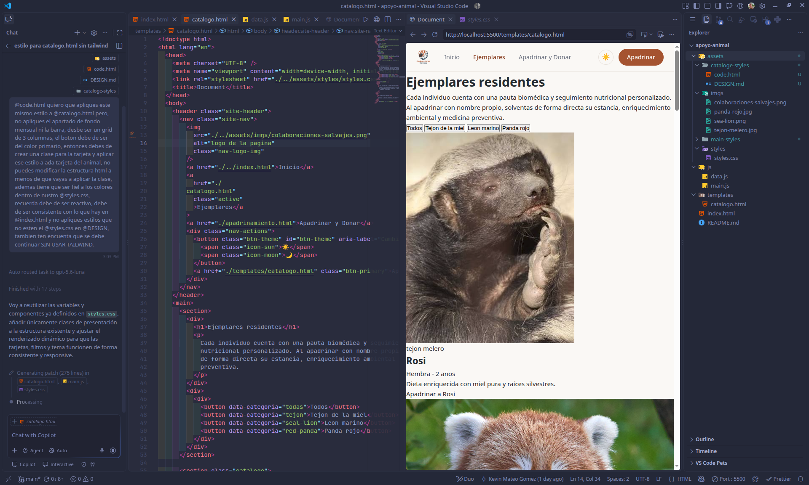

# Colaboraicones salvajes

Colaboraciones salvajes es una pagina donde cualquier persona puede donar o apadrinar un animal de nuestra protección, las especies que residen aqui son los leones marinos, pandas rojo y tejones meleros, todos ellos son ejemplares que fueron rescatados y especies que han estado en via de extincion o estan apunto de , cada ejemplar tiene un ciudado especial y un acompanamiento para su recuperacion y bienestar.

- **¿Para quien esta pensado?:** cualquier persona que quiera colaborar con la protección de los animales, tambien para personas que tengan desconfianza en donar por eso tenemos un catalogo donde puedan ver cada ejemplar.
- **¿Que problema resuelve?:** la falta de recursos para el cuidado de los animales, la falta de conciencia sobre la importancia de la protección de los animales en via de extincion.

## Sitio de publicacion:

- **Link de vercel:** https://apoyo-animal.vercel.app/
- **Repositorio:** https://github.com/KevinMateoG/apoyo-animal

## Capturas:






```
├── index.html                     # Página de inicio
├── templates/
│   ├── catalog.html                # Catálogo de animales (filtros + grid)
│   └── formSponsorship.html        # Formulario de apadrinamiento/donación
├── assets/
│   ├── imgs/                       # Imágenes de las especies
│   └── styles/
│       ├── styles.css               # Estilos globales / variables
│       ├── index.css
│       ├── catalog.css
│       └── formSponsorship.css
└── js/
    ├── data.js                     # Clase Animal + arreglo de animales
    ├── main.js                     # Tema oscuro, filtros, render del catálogo
    └── sponsorship.js              # Selector de animal y validación del formulario
```

Cada animal se modela en el archivo `data.js` mendiante una clase `Animal`, el cual contiene los atributos de `name`, `type_animal`, `age`, `gender` y `description`. En el archivo `catalogo.html` se enlistan los ejemplares agrupados en las tres especies ya mencionadas: tejon melero, panda rojo y leon marino. El formulario `formSponsorship.html` permite que la persona que quiera colaborar pueda conecar con un animal en especifico o tambien hacer una donacion general, y esto captura los datos de contacto y aporte.

## CSS: variables, flexbox y grid

Todas las variables de los colores quedaron concentrados en `styles.css` que es el css global, osea aqui concentramos todo lo relacionado con los colores de la pagina, el gradiente para el tema oscuro y claro, el color de los enlaces, los colores de los botones, los colores de las tarjetas, etc. Cada section tiene su propio css donde se trabaja el layout, por ejemplo en `catalog.css` se trabaja el layout del catalogo de animales, el cual esta compuesto por un grid de tarjetas que se adapta a diferentes tamaños de pantalla. En `formSponsorship.css` se trabaja el layout del formulario de apadrinamiento, el cual esta compuesto por un formulario que se adapta a diferentes tamaños de pantalla.

- **¿donde se aplica flexbox?:** En `catalog.css` se aplica en `catalogo-filtros` y en `animal-card__heading`. En `formSponsorship.css` se aplica en `form-fields` y en `form-actions`, esto se aplica para que los elementos se muestren en una columna en movil y en dos columnas en escritorio.

- **¿donde se aplica grid?:** En `catalog.css` se aplica en `catalogo-grid` para que las tarjetas de los animales se muestren en un grid de tres columnas en escritorio y en dos columnas en movil, y en casos mas extremos, osea en pantallas de celulares, solo se adapta a una sola columna, esto se logra con el minmax().

## JavaScript: intecciones

### Grupo A - DOM:

- **Catalogo generado dinamicamente:** en `main.js` se realiza un reccorrido del array de `arrayAnimals` que esta dentro de `data.js` y se crea una tarjeta por cada animal con `<artivle class="animal-card"`, usamos `document.createElement` para crear el elemento, `document.querySelector` para obtener el elemento padre, y `document.innerHTML` para insertar el elemento en el documento, usamos todo esto para hacer la pagina reactiva y no tener que quemar codigo en html y css, ademas de que se sienta mas natural, cuando el usuario hace clic en una tarjeta, se abre un modal con la informacion del animal, esto se logra con el evento `click` que se le asigna a cada tarjeta, y se utiliza `document.querySelector` para obtener el elemento padre, y `document.innerHTML` para insertar el elemento en el documento.

- **Filtro del catálogo:** los botones dentro de `catalogo-filtros` recorren con `forEach` todas las tarjetas (`.animal-card`) ya renderizadas en el DOM y comparan su atributo `data-category` con el filtro seleccionado (`data-filter` del botón). Si coinciden (o si el filtro es "Todos"), la tarjeta se muestra; si no, se oculta cambiando su propiedad `hidden`. También se actualiza la clase `filter-btn--active` para marcar visualmente el botón activo.

- **Selector de animal:** en `formSponsorship.html` hay un botón (`#animal-picker-trigger`) que abre un modal (`#animal-picker-modal`) con una tarjeta por cada animal disponible, generadas dinámicamente a partir del arreglo de `data.js`. Al hacer clic en una tarjeta se guarda el animal seleccionado en un input oculto (`#animal`) y se actualiza la vista previa del botón con su nombre, especie y género. El modal se puede cerrar con el botón de cierre, haciendo clic fuera (backdrop) o presionando `Escape`.

### Grupo B - Formularios y validación:

- **Campos requeridos:** En `sponsorship.js` se encuentran las validaciones de los campos del formulario (nombre, correo, direccion, aporte, animal a apadrinar), usamos `event.preventDefault()` para evitar que el formulario se envie, y usamos una funcion para validar cada campo, si algun campo no es valido, se muestra un mensaje de error y no se envia el formulario.

- **Formato de correo:** Para hacer la validacion del correo se usa expresiones regulares (regex).

- **Manejo de errores:** Los errores se listan en un contenedor, los errores se muestran en el div contenedor con `id="form-errors"` y si todo esta bien se muestra un modal de confirmacion.

### Grupo C - Eventos:

- `click` en el botón de tema oscuro/claro.
- `click` en los botones de filtro del catálogo.
- `click` para abrir/cerrar el selector modal de animal, y `keydown`
  (`Escape`) para cerrarlo.
- `submit` en el formulario de apadrinamiento.

### Modo oscuro:

EL boton `#btn-theme` hace alterna el atributo `data-theme` del elemento `html`, esto hace que cambie el tema de la pagina de oscuro a claro y viceversa, adicional guardamos el tema en `localStorage` para que persista entre sesiones.

### Uso de inteligencia artificial:

- **¿para que se uso?:** Use principalmente la IA para ayudarme primero a generar un estilo visual base del proyecto en <a href="https://stitch.withgoogle.com/">Stich</a> aqui se genero unos estilos y estructura html base, aunque stich usa tailwind solo fue hacer una adaptacion de los estilos a css puro,yo hacia una esturctura base del CSS y depues le pasaba el archivo de estilos que generaba stich para que me hiciera cambios o me diera ideas de como podria quedar, aunque no use la estuctura html que da Stich ya que no me parecia la mas legible entonces todo lo que tiene que ver con estructuracion de la pagina me encague yo.

- **¿Que parte me ayudo a resolver?:** Me ayudo a resolver muchos problemas que tengo a la hora de usar CSS como daptacion a diferentes tamaños de pantalla, el tema del modo oscuro, aplicar la animacion del modo oscuro, ya que son cosas que comun mento no hago,ademas de que me ayudo a resolver problemas con la adaptaicon de los estilos a la pantalla, tambien a crear diferentes animales, mucho del codigo que hice lo realizaba en un solo archivo dificultando la legibilidad asi que con el codigo ya hecho le pedi a la IA que separa todo en archivos legibles los cuales tuvieran el mismo nombre a la pagina que hacian refrerencia, esto me ahorro mucho tiempo de estar revisando codigo y cortando y pegando.

- **¿Que cambie del resultado:** Comunmente la IA tenia problemas con algunas adaptaciones de los estilos que Stich me daba, como no dejar espacios, no centrar el texto, hacer desaparecer elementos o no aplicar los estilos, entonces me encargaba de arreglar los estilos y estructuracion, algunas veces modificaba el JS que yo habia implementado y eso probocaba que no funcionara la pagina cuando lo probaba, asi que yo mismo arreglaba los error, remodificando lo que IA hacia para que funcionara correctamente, osea volvia a como lo tenia y en algunos momentos le preguntaba si habia una forma mas optima de hacerlo, pero la mayoria de veces preferia el codigo que yo implementaba.

- **¿Que aprendi del proceso:** Reforce bastante conocimiento sobre lo mas basico del desarrollo web, ya que usualmente usaba frameworks no tenia que usar tanto el CSS puro ni DOM, asi que fue un gran impulso para recordar bastantes cosas que habian quedado al fondo de mi memoria, ya que los frameworks recortan mucho trabajo que antes hacia manualmente, ademas muchas veces usamos frameworks de CSS como boopstrap, tailwind, bulma, etc, que nos facilitan el trabajo, pero no nos permiten entender realmente como funciona el CSS, mi mayor fuerte es back-end, pero fue bueno usar un poco de front-end, ademas de que la IA puede ser muy util para tener ideas y hacer separaciones de manera rapida.

### Lo mas dificil:

- **¿que fue lo mas complicado?:** Lo mas complicado para mi siempre sera el CSS ya que no soy bueno con el front-end y especialmente en esa parte, puedo aplicar ciertos estilos, realizar modificaciones, etc.
  pero cuando se trata de reactividad o de adaptaciones, siempre se me dificulta.

- **¿Por que fue dificil?:** Principalmente por que no suelo trabajar con CSS puro y ademas no suelo trabajar con animaciones y efectos, me gusta mas trabajar con back-end, que es mas logico y estructurado, el front-end me parece muy abstracto y desordenado, ademas de que se tiene que pensar mucho en colores llamativos, en las diferentes Utility-First CSS (CSS utilitario) como el minimalisto, o los principios YAGNI, todo lo que tenga que ver con estetica es lo que mas se me dificulta ademas de que se debe tener muchas cosas encuenta para poder hacer separaciones, centrado de elementos, animaciones y efectos.

- **¿como lo resolvio?:** Por suerte, la IA que use me ayudo bastante con el CSS, ya que me daba ideas de como podria quedar, ademas de que me ayudaba a separar el CSS en diferentes archivos, lo que facilitaba el trabajo, tambien me ayudaba a encontrar errores y a corregirlos, por lo que la IA fue una gran ayuda para mi en este aspecto, ademas de que tuve ayuda de un compañeros de clase que tienen mas experiencia en front-end y me ayudo con algunas ideas para la pagina ademas de recomendarme paginas como <a href="https://theme-toggle.rdsx.dev/">Theme Toggle</a> para las animaciones del modo oscuro, me diverti mucho con el JSDOM y fue bueno recordar el poco conocimiento sobre CSS que tengo y aprender mas de este.

**Evidencias del uso de IA:**




**¿Como ejecutar en local?:**
Se puede usar la extencion de `live server` de vscode o tambien con el comando npx:

```
npx serve .
```

con este se abre un servidor local en el puerto `3000`
